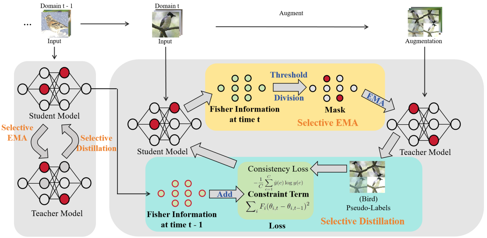

# Parameter-Selective Continual Test-Time Adaptation [ACCV 2024]
This is the official implementation of our ACCV 2024 paper "[Parameter-Selective Continual Test-Time Adaptation](https://arxiv.org/pdf/2407.02253)".


## Prerequisite

Please create and activate the following conda environment.

```bash
conda update conda
conda env create -f environment.yml
conda activate psmt
```

## Datasets Download（All data and model links are from publicly available models and data）

### CIFAR10-to-CIFAR10C

1. Download the pre-trained WideResNet-28 from RobustBench from the link: [here](https://drive.google.com/file/d/1t98aEuzeTL8P7Kpd5DIrCoCL21BNZUhC/view)

2. Rename the downloaded file "natural.pt.tar" to "Standard.pt" and move inside the directory `classification/ckpt/cifar10/corruptions/`

### CIFAR100-to-CIFAR100C

1. Download the pre-trained WideResNet-28 from RobustBench from the link: [here](https://docs.google.com/uc?export=download&confirm=t&id=1ocnHbvDdOBLvgNr6K7vEYL08hUdkD1Rv)

2. Move inside the directory `classification/ckpt/cifar100/corruptions/`

### ImageNet-to-ImageNetC

1. Download the dataset from the link: [Download](https://zenodo.org/record/2235448#.Yj2RO_co_mF)
2. Move inside the directory `classification/data/`

## Experiments
Run the following command:

```bash
python test_time.py --cfg cfgs/[cifar10_c/cifar100_c/imagenet_c]/[source/norm_test/norm_alpha/tent/eata/sar/cotta/psmt].yaml
```

If you want to try the gradual task, you can find `conf.py` and set `_C.SETTING = gradual`.
